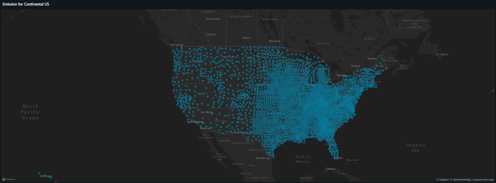

## 🌍 Análise de Emissões de Carbono (2023) - Databricks

Este projeto consiste em uma análise exploratória e visual das emissões de gases de efeito estufa (GHG) nos Estados Unidos, utilizando dados do ano de 2023. O desenvolvimento foi realizado inteiramente no ambiente Databricks, desde o tratamento dos dados brutos até a criação de dashboards interativos.


## 📁 Estrutura do Repositório

- ```src/```: Contém o arquivo fonte principal.


    - ```Emissions_Data_2023.csv```: Dados brutos contendo informações de geolocalização, população, consumo de energia e emissões por condado.

- ```Emissions Dashboard.lvdash.json```: Arquivo de exportação do Databricks Lakeview Dashboard para reprodução das visualizações.
## 🛠️ Tecnologias e Ferramentas

 - Databricks Lakehouse: Plataforma principal de processamento.

 - Spark SQL: Utilizado para limpeza de strings, conversão de tipos de dados e cálculos agregados.

 - Lakeview Dashboards: Ferramenta de visualização para mapas e gráficos analíticos.
## 🚀 Etapas do Projeto

1. Ingestão e Limpeza de Dados
O arquivo CSV original apresentava números formatados como texto (ex: "178,360"), o que exigiu um tratamento via SQL para possibilitar cálculos matemáticos:

 - Remoção de vírgulas de milhares.

 - Conversão de tipos para DOUBLE e INT.

 - Tratamento de valores nulos para evitar erros em divisões.

2. Engenharia de Atributos
Criamos métricas personalizadas para enriquecer a análise, como:

 - Emissão per Capita: Divisão das emissões totais pela população de cada condado.

 - Intensidade Energética: Relação entre o consumo em MWh e a pegada de carbono gerada.

3. Visualização (Dashboard)
O dashboard incluído neste repositório foca em três pilares:

 - Mapeamento Geográfico: Visualização das fontes de emissão via Latitude e Longitude.

 - Ranking de Poluição: Identificação dos condados e estados com maiores volumes de CO2e.

 - Análise Populacional: Comparativo entre o tamanho da população e o impacto ambiental.
## 📊 Consulta Utilizada

Localização dos dados
```
select latitude,
longitude,
'GHG emissions mtons CO2e' as Emissions
from emission.default.emissions_data
```

Emissão por Pessoa
```
SELECT county_state_name,
       population,
       cast(
         replace(`GHG emissions mtons CO2e`, ',', '') 
         AS double
       ) / nullif(
         cast(
           replace(population, ',', '') 
           AS double
         ), 0
       ) AS Emissions_per_person
FROM emission.default.emissions_data
ORDER BY emissions_per_person DESC
```

Total de Emissão por Estado
```
SELECT state_abbr,
       SUM(CAST(
         REPLACE(`GHG emissions mtons CO2e`, ',', '') 
         AS DOUBLE
       )) AS Total_Emission
FROM emissions_data
GROUP BY state_abbr
ORDER BY Total_Emission DESC
LIMIT 10
```

Counting shaming
```
SELECT county_state_name,
       population,
       cast(
         replace(`GHG emissions mtons CO2e`, ',', '') 
         AS DOUBLE) AS Total_Emissions
FROM emission.default.emissions_data
ORDER BY Total_Emissions DESC
LIMIT 10
```

## ⚙️ Como Utilizar este Repositório 

1. No Databricks: Faça o upload do arquivo em src/Emissions_Data_2023.csv para um Volume do Unity Catalog ou DBFS.

2. Criação da Tabela: Crie uma tabela Delta a partir do CSV.

3. Dashboard:

- Vá na aba Dashboards.

- Clique em Create > Import from file.

- Selecione o arquivo Emissions Dashboard.lvdash.json.

- Conecte o dataset à tabela que você criou.

## 🖼️ Visualizações do Dashboard

| Mapa de Localização das Emissões | Relação Localização vs População |
|:---:|:---:|
|  |  |